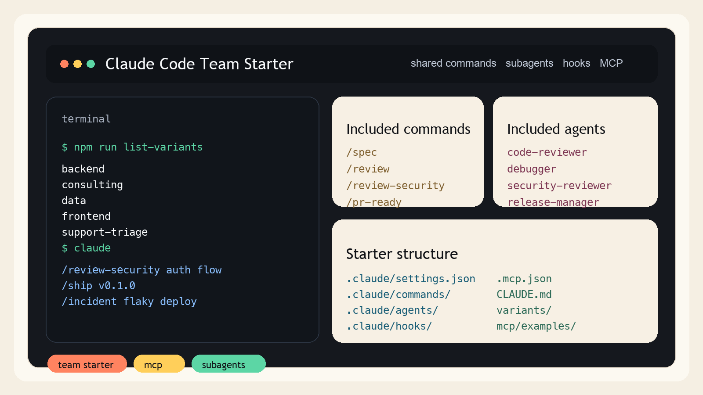

# Claude Code Team Starter Template

[](https://github.com/Keepfox/claude-code-team-starter/actions/workflows/validate.yml)
[](LICENSE)

Safe, team-friendly starter repo for running real work with Claude Code.

Claude Code starter template for teams that want shared MCP setup, project slash commands, subagents, hooks, and a maintainable `CLAUDE.md`.



This repository gives you a practical baseline for:

- shared project settings in `.claude/settings.json`
- reusable project slash commands in `.claude/commands/`
- specialized subagents in `.claude/agents/`
- reusable team skills in `.claude/skills/`
- deterministic safety hooks in `.claude/hooks/`
- MCP examples in `.mcp.json` and `mcp/`
- a starter `CLAUDE.md` for team conventions

Keywords people usually search for:

- Claude Code starter
- Claude Code template
- Claude Code MCP setup
- Claude Code subagents
- Claude Code slash commands
- Claude Code hooks

This repo is designed for teams that want a public, understandable starting point instead of a private collection of prompts and ad hoc local settings.

## What This Is

This is **not** a Claude Code clone.

It is a clean starter template built around Claude Code's official extension points:

- project settings
- slash commands
- subagents
- hooks
- MCP configuration
- project memory in `CLAUDE.md`

If you are searching for a reusable Claude Code template with MCP examples, shared commands, subagents, and safer defaults for team workflows, this is that baseline.

Official docs:

- https://docs.anthropic.com/en/docs/claude-code/overview
- https://docs.anthropic.com/en/docs/claude-code/settings
- https://docs.anthropic.com/en/docs/claude-code/slash-commands
- https://docs.anthropic.com/en/docs/claude-code/sub-agents
- https://docs.anthropic.com/en/docs/claude-code/hooks
- https://docs.anthropic.com/en/docs/claude-code/mcp

## Good Fit

This starter is a good fit if you want to standardize Claude Code usage across:

- solo consulting work
- small engineering teams
- internal platform teams
- client delivery teams
- MCP-heavy repositories with shared tooling

## Why Teams Use This

Teams usually adopt this starter when they want:

- one shared Claude Code setup instead of per-developer local drift
- a repeatable MCP baseline for GitHub, Postgres, docs, and internal tools
- reusable slash commands for review, planning, release, and incident work
- subagents that encode common engineering roles
- safer defaults for shells, secrets, and project files

## Visual Assets

- README screenshot: `assets/readme-preview.png`
- GitHub social preview image: `assets/social-preview.png`

## Quick Start

1. Install Claude Code.

```bash
npm install -g @anthropic-ai/claude-code
```

2. Copy the template into your project.

```bash
cp -R .claude /path/to/your-project/
cp CLAUDE.md /path/to/your-project/
cp .mcp.json /path/to/your-project/
```

Or install it with the helper script:

```bash
node scripts/install.mjs /path/to/your-project
```

For more install patterns and first-run checks:

- [docs/install.md](docs/install.md)
- [examples/README.md](examples/README.md)

3. Open your project and start Claude Code.

```bash
cd /path/to/your-project
claude
```

4. Check that the starter is loaded.

- Run `/help` to see the project commands
- Run `/agents` to see the project subagents
- Run `/mcp` to inspect MCP connections
- Open `.claude/settings.json` and adjust permissions for your stack

## Variant Packs

This starter also includes overlay variants for common working styles:

- `backend`
- `consulting`
- `data`
- `frontend`
- `support-triage`

Apply a variant during install:

```bash
node scripts/install.mjs /path/to/your-project --variant backend
```

See [docs/variants.md](docs/variants.md) for details.

Quick references:

- variant map: [variants/README.md](variants/README.md)
- install flags: `npm run install-help`
- available variants: `npm run list-variants`

## Included Commands

- `/spec [feature-or-change]`
  Creates an implementation plan before coding.
- `/review [focus]`
  Reviews the current working tree and reports findings first.
- `/review-security [scope]`
  Reviews the current working tree with a security-first lens.
- `/fix-test [test-command]`
  Runs the smallest relevant test command and fixes failures.
- `/incident [symptom]`
  Triage flow for bugs, production issues, and flaky behavior.
- `/ship [scope-or-version]`
  Builds a release checklist, rollout notes, and risk summary.
- `/pr-ready [scope]`
  Prepares a merge-ready summary with tests, risks, and follow-up notes.
- `/summarize-diff [scope]`
  Turns the current working tree into a compact changelog-style summary.

## Included Subagents

- `code-reviewer`
- `test-runner`
- `debugger`
- `release-manager`
- `docs-writer`
- `security-reviewer`

These are project-level agents, so your team can share a common workflow without depending on private home-directory config.

## Included Skills

- `release-checklist`

This is a small example of a shared team skill. Use it as a pattern for stack-specific or team-specific reusable guidance.

## Safety Defaults

This starter ships with conservative defaults:

- denies reading obvious secret files via `permissions.deny`
- blocks edits to sensitive files via a `PreToolUse` hook
- asks for confirmation on risky shell commands via a `PreToolUse` hook
- disables bypass-permissions mode in shared project config
- disables `Co-Authored-By Claude` by default

You should still review and tailor the rules for your environment.

## MCP

The root `.mcp.json` is intentionally minimal and safe to commit.

- add your shared MCP servers there
- keep secrets in environment variables
- use `${VAR}` or `${VAR:-default}` expansion
- keep private credentials out of version control

See `mcp/README.md` for examples.

Ready-to-adapt MCP profiles:

- [mcp/examples/github-postgres.json](mcp/examples/github-postgres.json)
- [mcp/examples/issue-triage.json](mcp/examples/issue-triage.json)

## Suggested Use

For a small team, this repo is enough to standardize:

- planning before large changes
- review before merge
- test-fixing workflow
- release preparation
- safer shell/file behavior
- common MCP integrations

For a consultancy or internal platform team, this can become the base for:

- language-specific starter kits
- vertical packs for web/backend/data teams
- customer-specific MCP bundles
- team onboarding docs and agent policies

## Repository Layout

```text
.
├── .claude/
│   ├── agents/
│   ├── commands/
│   ├── docs/
│   ├── hooks/
│   ├── skills/
│   └── settings.json
├── .mcp.json
├── CLAUDE.md
├── CONTRIBUTING.md
├── SECURITY.md
├── docs/
├── examples/
└── mcp/
```

## Customization Guide

Start here:

- [docs/install.md](docs/install.md)
- [docs/commands.md](docs/commands.md)
- [docs/agents.md](docs/agents.md)
- [docs/customize.md](docs/customize.md)
- [docs/public-launch-checklist.md](docs/public-launch-checklist.md)
- [docs/adoption-playbook.md](docs/adoption-playbook.md)
- [docs/publish.md](docs/publish.md)
- [docs/roadmap.md](docs/roadmap.md)
- [docs/use-cases.md](docs/use-cases.md)
- [docs/variants.md](docs/variants.md)
- [examples/README.md](examples/README.md)
- [variants/README.md](variants/README.md)
- [CHANGELOG.md](CHANGELOG.md)
- [CONTRIBUTING.md](CONTRIBUTING.md)

## Legal Note

This repository is an independent starter template for Claude Code workflows.

It is not affiliated with or endorsed by Anthropic.
