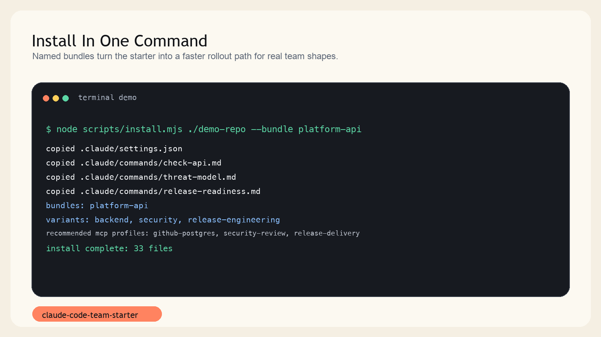
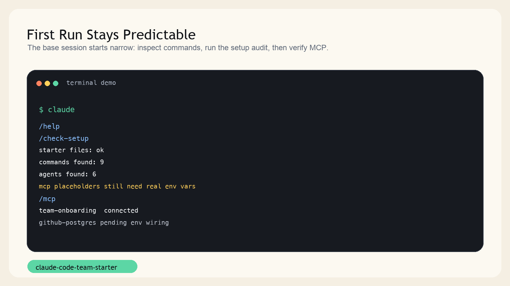
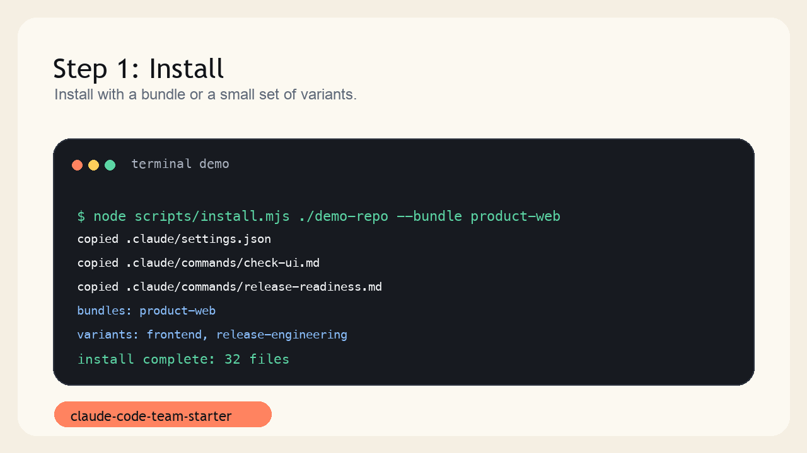

# Install Guide

This guide covers the fastest ways to copy the starter into a real project.

## Prerequisites

- Node.js 18 or newer
- Claude Code installed locally

```bash
npm install -g @anthropic-ai/claude-code
```

## Option 1: Copy the starter files directly

From this repository:

```bash
cp -R .claude /path/to/your-project/
cp CLAUDE.md /path/to/your-project/
cp .mcp.json /path/to/your-project/
```

Use this when you want full control over which files are copied.

## Option 2: Use the install script

Base starter:

```bash
node scripts/install.mjs /path/to/your-project
```

Preview without writing files:

```bash
node scripts/install.mjs /path/to/your-project --dry-run
```

Overwrite an existing starter setup:

```bash
node scripts/install.mjs /path/to/your-project --force
```

Install with a variant:

```bash
node scripts/install.mjs /path/to/your-project --variant frontend
```

Install with a bundle:

```bash
node scripts/install.mjs /path/to/your-project --bundle product-web
```

Install with a stack-aware bundle:

```bash
node scripts/install.mjs /path/to/your-project --bundle node-service
```

Install with multiple variants:

```bash
node scripts/install.mjs /path/to/your-project --variant frontend --variant consulting
```

You can also use a comma-separated list:

```bash
node scripts/install.mjs /path/to/your-project --variant frontend,consulting
```

Show supported variants:

```bash
node scripts/install.mjs --list-variants
```

Show supported bundles:

```bash
node scripts/install.mjs --list-bundles
```

Show script help:

```bash
npm run install-help
```

## Install preview

This is the intended shape of a successful starter install:



## First-run smoke check

After copying the files into your project:

1. Open the project root.
2. Start `claude`.
3. Run `/help`.
4. Run `/check-setup`.
5. Run `/agents`.
6. Run `/mcp`.
7. Review `.claude/settings.json` before making broader permissions changes.

Visual reference:



Quick animated walkthrough:



## Recommended onboarding path

For a new team member or a fresh repo rollout:

1. Start with the base starter only.
2. Copy one small MCP profile, usually `mcp/examples/team-onboarding.json`.
3. Get GitHub, docs, and task access working before adding operational or database MCP servers.
4. Run `/check-setup` and `/review` on a harmless diff to confirm the workflow feels predictable.
5. Add variants only after the baseline feels familiar to the team.

If you want the full first-week flow, use [docs/onboarding.md](onboarding.md).

If your team shape is already clear, start from [docs/bundles.md](bundles.md) before choosing variants one by one.

If the repo is clearly Node, Python, or Go, prefer one of the stack-aware bundles so the installer also points you to the matching example, skills, and hook recipes.

## Recommended first edits

Change these first:

- `.claude/settings.json`
- `CLAUDE.md`
- `.mcp.json`

If you are unsure what belongs in each file, use [config-layers.md](config-layers.md).

Then adapt:

- `.claude/commands/` for your workflow
- `.claude/agents/` for your team roles
- `.claude/hooks/` for your safety model
- `.claude/hooks/recipes/` if you want optional hook patterns without enabling them globally on day one
- `examples/` and `.claude/skills/` if you want a stack-specific memory plus checklist layer for Node, Python, or Go

If you combine multiple variants, later variants win when they write the same file path.
